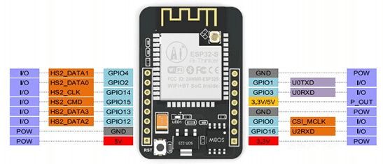
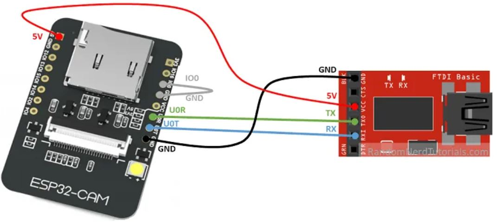
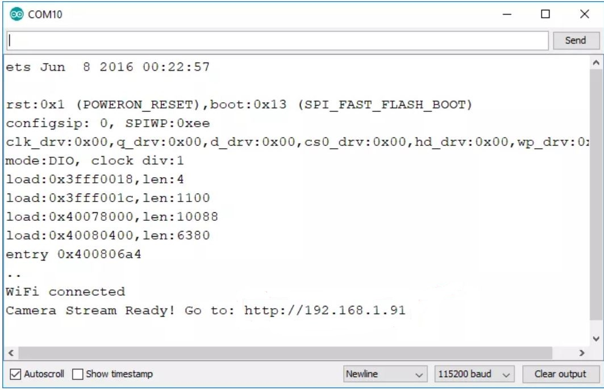

# ESP32-CAM-Video-Streaming-Web-Server

### Encouraged by  <a href="https://appiko.org/">Appiko</a>

### OBJECTIVE
To host a video streaming web server that you can access with any device in your network.

### INTRODUCTION

This is an extension of previous project ESP-32 CAM ,saving photo on sd card,and in this project I have extended for online live video streaming web server with the ESP32-CAM.

  

 
After the code is uploaded on the board using FTDI programmer, 
  
The ESP32 IP address should be printed in the Serial Monitor.
  

